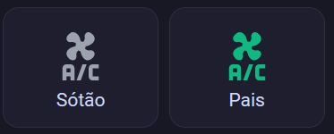

# ❄️ A/C Climate Control Button Cards

This document describes a `custom:button-card` layout used to control
Home Assistant climate entities (A/C units).

## Features

- Tap → opens climate control (more-info)
- Displays A/C icon and label
- Icon color reflects current HVAC activity
- Designed for horizontal stacks

## Visual Layout

## Color Logic

| HVAC State | Color |
|----------|------|
| Off | Gray |
| Cooling | Blue |
| Heating | Orange |
| Idle / Fan | Green |

Uses `hvac_action` when available, falls back to `hvac_mode`.

## Required Entity

- `climate.<entity_id>`

Examples:

## Example

See [`climate-ac-example.yaml`](./climate-ac-example.yaml)
