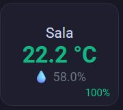

# 🌡️ Temperature & Humidity Button Cards

This document describes a reusable `custom:button-card` pattern used to
display temperature, humidity, and battery level for Zigbee / WiFi sensors
in Home Assistant.

I'm using Tuya ts0201 mostly, but it should work with others.

## Features

- Main value: **Temperature**
- Secondary value: **Humidity**
- Corner badge: **Battery level (color-coded)**
- Tap action: opens temperature entity
- Hold action: opens humidity entity
- Designed for horizontal stacks

## Visual Layout

## Color Logic

### Temperature
| Value | Color |
|-----|------|
| < 18°C | Blue |
| 18–24°C | Green |
| ≥ 25°C | Red |

### Battery
| Level | Color |
|------|------|
| < 20% | Red |
| 20–39% | Orange |
| ≥ 40% | Green |

## Required Entities

For each sensor group:

- `<prefix>_temperature`
- `<prefix>_humidity`
- `<prefix>_battery`

Example:
## Example

See [`temp-humidity-example.yaml`](./temp-humidity-example.yaml)